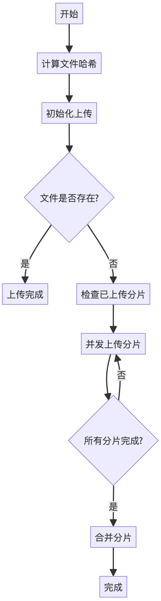

# Big File Uploader

一个支持大文件分片上传的前端组件，具备断点续传、暂停恢复等功能。

## 特性

- ✨ 大文件分片上传
- 🚀 并发上传控制
- 💪 断点续传支持
- ⏯️ 暂停/恢复功能
- 🔄 自动重试机制
- 📊 实时进度反馈
- 🛡️ TypeScript 支持

## 安装

```bash
npm install big-file-uploader
# 或者
yarn add big-file-uploader
```

## 使用示例

### 基础用法

```typescript
import { BigFileUploader } from 'big-file-uploader';

const uploader = new BigFileUploader({
  file: File,                   // 待上传的文件
  baseURL: 'http://api.example.com',  // API基础URL
  endpoints: {
    init: '/upload/init',       // 初始化上传
    chunk: '/upload/chunk',     // 上传分片
    merge: '/upload/merge',     // 合并分片
    progress: '/upload/progress' // 查询进度
  },
  onProgress: (progress) => {
    console.log(`上传进度: ${progress}%`);
  },
  onSuccess: (response) => {
    console.log('上传成功:', response);
  },
  onError: (error) => {
    console.error('上传失败:', error);
  }
});

// 开始上传
await uploader.start();
```

### 高级配置

```typescript
const uploader = new BigFileUploader({
  // 必需参数
  file: File,
  baseURL: 'http://api.example.com',
  endpoints: {
    init: '/upload/init',
    chunk: '/upload/chunk',
    merge: '/upload/merge',
    progress: '/upload/progress'
  },
  
  // 可选参数
  chunkSize: 5 * 1024 * 1024,  // 分片大小，默认5MB
  concurrent: 3,               // 并发上传数，默认3
  headers: {                   // 自定义请求头
    'Authorization': 'Bearer token'
  },
  withCredentials: true,      // 是否携带认证信息
  maxRetries: 3,             // 最大重试次数
  
  // 回调函数
  onProgress: (progress) => {
    console.log(`上传进度: ${progress}%`);
  },
  onSuccess: (response) => {
    console.log('上传成功:', response);
  },
  onError: (error) => {
    console.error('上传失败:', error);
  },
  onChunkSuccess: (chunkIndex, response) => {
    console.log(`分片 ${chunkIndex} 上传成功`);
  }
});
```

### 控制上传过程

```typescript
// 开始上传
await uploader.start();

// 暂停上传
uploader.pause();

// 继续上传
uploader.resume();

// 中止上传
uploader.abort();
```

## API 文档

### 构造函数选项

| 参数 | 类型 | 必需 | 默认值 | 说明 |
|------|------|------|--------|------|
| file | File | 是 | - | 待上传的文件 |
| baseURL | string | 是 | - | API基础URL |
| endpoints | object | 是 | - | API端点配置 |
| chunkSize | number | 否 | 5MB | 分片大小 |
| concurrent | number | 否 | 3 | 并发上传数 |
| headers | object | 否 | {} | 自定义请求头 |
| withCredentials | boolean | 否 | false | 是否携带认证信息 |
| maxRetries | number | 否 | 3 | 最大重试次数 |
| onProgress | function | 否 | - | 进度回调 |
| onSuccess | function | 否 | - | 成功回调 |
| onError | function | 否 | - | 错误回调 |
| onChunkSuccess | function | 否 | - | 分片上传成功回调 |

### 实例方法

| 方法 | 说明 | 返回值 |
|------|------|--------|
| start() | 开始上传 | Promise<void> |
| pause() | 暂停上传 | void |
| resume() | 继续上传 | void |
| abort() | 中止上传 | void |

## 上传流程说明

### 完整上传流程


1. **文件预处理**
   - 计算文件 SHA-256 哈希值（占进度 20%）
   - 根据 `chunkSize` 将文件分片
   - 初始化上传状态

2. **初始化上传会话**
   - 发送 `POST /upload/init` 请求
   - 携带文件信息和哈希值
   - 获取 `uploadId`
   - 检查文件是否已存在（秒传）

3. **分片并发上传**
   - 检查已上传的分片（断点续传）
   - 按配置的并发数上传分片
   - 分片上传进度实时反馈（占进度 80%）
   - 失败自动重试

4. **合并分片**
   - 所有分片上传完成后
   - 发送合并请求
   - 获取最终文件 URL

## 服务端接口要求

### 1. 初始化上传 (`/upload/init`)

**请求参数：**
```typescript
{
  fileName: string;     // 文件名
  fileSize: number;     // 文件大小
  chunkSize: number;    // 分片大小
  fileHash: string;     // 文件哈希值
}
```

**响应格式：**
```typescript
{
  uploadId: string;     // 上传会话ID
  exists?: boolean;     // 文件是否已存在
}
```

### 2. 上传分片 (`/upload/chunk`)

**请求格式：**
```typescript
FormData {
  file: Blob;          // 分片数据
  chunkIndex: number;  // 分片索引
  uploadId: string;    // 上传会话ID
  fileHash: string;    // 文件哈希值
}
```

### 3. 合并分片 (`/upload/merge`)

**请求参数：**
```typescript
{
  uploadId: string;     // 上传会话ID
  fileHash: string;     // 文件哈希值
  fileName: string;     // 文件名
  totalChunks: number; // 总分片数
}
```

### 4. 查询进度 (`/upload/progress`)

**请求参数：**
```typescript
{
  uploadId: string;    // 上传会话ID
}
```

**响应格式：**
```typescript
{
  uploadedChunks: number[];  // 已上传分片索引
  isComplete: boolean;       // 是否已完成
}
```

### Node.js 示例项目

完整的服务端实现示例，包括文件分片存储、合并、断点续传等功能：

- 示例仓库：[big-file-uploader-demo](https://github.com/Misszhu/big-file-uploader-demo.git)
- 技术栈：Node.js + Express
- 功能特性：
  - ✅ 分片上传接口
  - ✅ 秒传判断
  - ✅ 断点续传支持
  - ✅ 分片合并
  - ✅ 临时文件管理
  - ✅ 完整的错误处理
